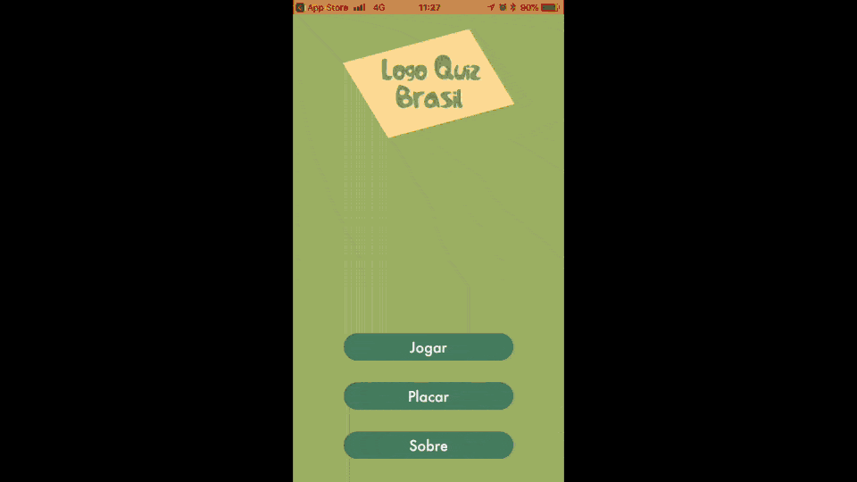

# Welcome to Logo Quiz Brasil  👋 🇧🇷

Logo Quiz Brasil is a trivia game, where from an incomplete logo brand image you need to guess which product or company is related to, by writing it's name under the incomplete image.

In order to help you out, you can use three _hints_ with a cost of some coins. If it's too impossible for you and you want to give up, you can review the logo by using the _magic_ button with a cost of more coins. You can get coins by guessing logos or by buying from the shopping.

You can try it by yourself on [iTunes](https://itunes.apple.com/us/app/logo-quiz-brasil/id672062811?mt=8). 🚀
## A bit of history... 👴

This project started in 2013, as a weekend project. At that time, trivia _logo quizzes_ were very famous in the App Store, but all of them were made with brands from the US or Europe. Logo Quiz Brasil was the first one at the time to bring only Brazilian brands in the scope, hitting some success at the time exactly for that. In the first year, it reached the top #5 for trivia games in the Brazilian app store. Not too bad for a weekend pet project, huh? 😁

## The project 🤓

The project was developed in 2013, with some maintenance given during those years. I beg your pardon for the structure, as I had a naïve approach for many technical decisions. For instance, there was no unit test at the time, database was made prior in the user defaults and my MVC implementation carried much of the problems we fixed with MVVM / VIPER, such as the massive-VCs.

Despite that, I implemented cool features such as:
- [Flurry](https://y.flurry.com/) for the answers analytics
- [Firebase](https://firebase.google.com/) for more analytics
- [Admob](https://www.google.com/admob/)
- [Crashlytics](https://try.crashlytics.com/)
- GameCenter
- InAppPurchases
- [Fastlane](https://fastlane.tools/)

If I'd redo the project today, I'd certain:
- Implement something on the cloud, maybe iCloud, to store the coins and results
- Migrate to Swift - all of it
- Implement Unit and UI tests
- Unify iPad and iPhone storyboards - yep, back in the days they used to be separated
- Change the architecture to MVVM ❣️

## Questions 🤔
#### Why I can't play the app store version from my Xcode? 😱

At this moment I'm not versioning the content of the game, as I believe it is too sensible to be open. Despite that, there are some mocks with some brands just to have a taste of the gameplay. You are, of course, free to try a little bit and even create your own content to play a bit.

#### Is there an Android version? 🤖
Yep! Actually Brazilian market is dominated by Android, so it would make sense to be the main version. Funny enough I had both apps in both stores for more than a year and, daily, the iOS version still brings 5x more users than the Android one. Not sure why. Anyway, this project is not open sourced yet so when it's ready I'll update here.
